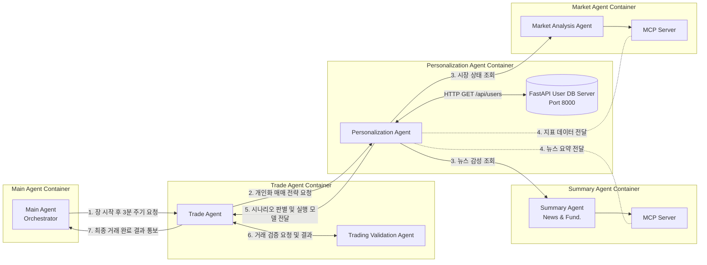
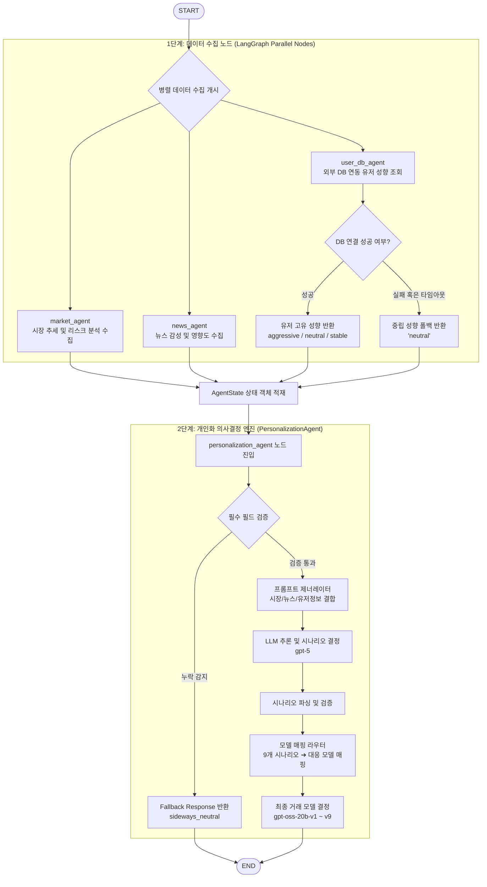

# Personalization Agent

미국 주식 자동매매를 위한 AI 기반 개인화 에이전트입니다. 외부 백엔드 API 서비스와 LangGraph 워크플로우를 활용하여 시장 상황, 뉴스 분석, 사용자 투자 성향을 종합적으로 판단하고 최적의 투자 시나리오 및 최적 모델을 결정합니다.

---

## 1. 아키텍처 설계 (Architecture)

본 에이전트는 **인프라 결합도 분리(FastAPI)** 및 **단일 프로세스 내 에이전트 제어 최적화(LangGraph)** 를 실현한 구조를 가지고 있습니다.



### 1.2. 개인화 에이전트 내부 로직 아키텍처 (Personalization Agent Internal Logic)



---

## 2. 주요 기능 (Features)

- **LangGraph 기반 오케스트레이션**: 단일 프로세스 내에서 시장 데이터 수집, 뉴스 데이터 수집, 유저 프로필 조회를 비동기/병렬로 수행하고 최종 노드에서 취합(Merge)합니다.
- **FastAPI 외부 DB 통신**: 기존 로컬 시뮬레이터를 걷어내고, 독립적으로 구동되는 외부 FastAPI 서버(`Port 8000`)를 통해 실제 API 통신으로 유저 성향 정보를 실시간 조회합니다.
- **LLM 기반 시나리오 결정**: 수집한 모든 데이터(시장 상황 3종 × 투자 성향 3종 = 9개 시나리오)를 컨텍스트로 LLM을 호출하여 최적의 투자 시나리오 및 실행 모델을 결정합니다.
- **네트워크 예외 처리**: 외부 DB 서버 연결 실패 시 기본값(`neutral`)으로 안전하게 대체 구동되는 Fallback 메커니즘을 지원합니다.

---

## 3. 시스템 요구사항 및 설치

### 필수 요구사항
- **Python**: 3.9+ (LangGraph 및 FastAPI 지원 버전)
- **OpenAI API Key**: OpenAI 호출용 API 키가 필요합니다.

### 패키지 설치
```bash
pip install -r requirements.txt
```

### 환경변수 설정 (.env)
프로젝트 루트 디렉토리에 `.env` 파일을 생성하고 다음과 같이 API 키를 입력합니다:
```env
OPENAI_API_KEY=your-actual-openai-api-key-here
```

---

## 4. 실행 방법

### ① FastAPI DB 서버 백그라운드 구동 (Port 8000)
사용자 프로필 조회를 처리하는 외부 데이터베이스 API 서버를 먼저 기동합니다.
```bash
python run_db.py
```

### ② LangGraph 에이전트 구동
새로운 터미널 창을 열고, 단일 프로세스 내에서 병렬 데이터 수집 및 의사결정을 수행하는 워크플로우 에이전트를 실행합니다.
```bash
python run_workflow.py
```

---

## 5. 입력 및 출력 데이터 형식 (JSON)

### 시장 분석 데이터 (Market Data Input)
```json
{
  "date": "2024-01-29",
  "short_term": "bull",
  "mid_term": "bull",
  "long_term": "bull",
  "risk_level": "medium",
  "risk_score": 2,
  "liquidity": "tight_and_rising"
}
```
**허용 범위 및 메타데이터:**
- `short_term`, `mid_term`, `long_term`: `"bull"` (상승), `"bear"` (하락), `"sideways"` (횡보)
- `risk_level`: `"low"` (낮음), `"medium"` (보통), `"high"` (높음), `"panic"` (공포)
- `risk_score`: `0` ~ `6` 범위의 정수
- `liquidity`: `"loose"` (풍부), `"neutral"` (보통), `"tight_and_rising"` (긴축 상승), `"tight_but_easing"` (긴축 완화)

### 뉴스 분석 데이터 (News Data Input)
```json
{
  "news_analysis": {
    "summary": "AI 기술 호평으로 긍정적 전망",
    "sentiment_score": 0.7,
    "market_impact": 8
  }
}
```
**허용 범위 및 메타데이터:**
- `sentiment_score`: `-1.0` (매우 부정) ~ `+1.0` (매우 긍정) 범위의 실수
- `market_impact`: `1` (낮음) ~ `10` (매우 높음) 범위의 정수

### 사용자 프로필 데이터 (User DB / FastAPI GET Output)
```json
{
  "user_id": "user_001",
  "risk_tolerance": "aggressive"
}
```
**허용 범위 및 메타데이터:**
- `risk_tolerance`: `"aggressive"` (공격형), `"neutral"` (중립형), `"stable"` (안정형)


### 의사결정 최종 출력 데이터 (Final Output)
```json
{
  "scenario": "bull_aggressive",
  "selected_model": "gpt-oss-20b-v1"
}
```

---

## 6. 9개 투자 시나리오 정의

시장의 흐름과 사용자의 성향을 매핑하여 9개의 시나리오와 모델이 결정됩니다:

| 시장 상황 | 공격형 (Aggressive) | 중립형 (Neutral) | 안정형 (Stable) |
|----------|-------------------|-----------------|----------------|
| 상승장 (Bull) | bull_aggressive | bull_neutral | bull_stable |
| 보합장 (Sideways) | sideways_aggressive | sideways_neutral | sideways_stable |
| 하락장 (Bear) | bear_aggressive | bear_neutral | bear_stable |

---

## 7. 코드 구조 및 역할

### 📁 전체 디렉토리 구성
```
a2a-agent-personalization
├── src/
│   ├── agents/                   # LLM 및 개인화 에이전트 모듈
│   │   └── personalization_agent.py
│   ├── api/                      # 외부 FastAPI DB 모의 서버
│   │   └── server_db.py
│   └── workflows/                # LangGraph 비동기 제어 루프
│       └── personalization_workflow.py
├── run_db.py                     # DB 서버 기동 진입 스크립트
├── run_workflow.py               # 워크플로우 에이전트 구동 진입 스크립트
├── Dockerfile                    # 서비스별 컨테이너 빌드 정의서
├── docker-compose.yml            # 멀티 컨테이너 서비스 오케스트레이션 구성 파일
└── .env                          # API 키 설정 파일
```

### 📁 server_db.py 상세 구조
- **FastAPI App Instance** (`app`): 사용자 정보 데이터 조회를 제공하는 엔드포인트 호스트.
- **In-Memory Database** (`USERS_DB`): 가상의 사용자 프로필 데이터 셋.
- **GET Endpoint** (`/api/users/{user_id}`): 지정된 유저의 성향 정보(`risk_tolerance`)를 JSON 형식으로 조회하여 반환.

### 📁 personalization_agent.py 상세 구조
```
personalization_agent.py
├── APILLM                            # OpenAI API 호출 및 비용 분석 클래스
│   ├── generate(prompt)              # 프롬프트 호출 및 비용 누적 계산
│   ├── _calculate_cost()             # 입력/출력 토큰 기반 비용 측정
│   └── print_summary()               # 누적 사용 토큰 및 비용 최종 요약 출력
├── PersonalizationAgent              # 의사결정 비즈니스 로직 클래스
│   ├── validate_inputs()             # 수집된 에이전트 데이터 검증
│   ├── create_prompt()               # 의사결정을 위한 LLM 프롬프트 조립
│   ├── parse_scenario()              # LLM의 자연어 응답에서 핵심 시나리오 파싱
│   └── select_model()                # 판단된 시나리오에 1:1 대응하는 모델 선택
├── AgentState (TypedDict)            # 워크플로우 노드 간 공유되는 상태 객체
├── Workflow Nodes (LangGraph 노드 함수)
│   ├── market_analysis_node(state)   # 시장 상황 데이터 적재 노드 (Mock)
│   ├── news_analysis_node(state)     # 뉴스 데이터 적재 노드 (Mock)
│   ├── user_db_node(state)           # server_db.py에 HTTP API 통신을 수행하는 유저 DB 조회 노드
│   └── personalization_decision_node # 수집 데이터를 취합하여 최종 의사결정을 수행하는 판단 노드
├── build_workflow()                  # StateGraph 빌드 및 라우팅 설정 컴파일
└── main()                            # 3명의 테스트 유저에 대한 비동기 실행 메인 진입 함수
```


---

## 8. 커스터마이징 방법

### 사용자 추가
`server_db.py` 파일 내 `USERS_DB` 딕셔너리에 사용자를 수동 추가하거나 API를 확장할 수 있습니다.
```python
USERS_DB = {
    "user_001": {"risk_tolerance": "aggressive"},
    "your_user_id": {"risk_tolerance": "neutral"}
}
```

### 에이전트 모델 설정 변경
`personalization_agent.py` 내 `personalization_decision_node`에서 구동 모델을 설정할 수 있습니다.
```python
llm = APILLM(model_name="gpt-4o-mini")  # 다른 OpenAI 모델로 교체 가능
```

---

## 9. Docker 기반 컨테이너 실행 방법

본 프로젝트는 분산 마이크로서비스 환경 모방 및 쉬운 이식성을 위해 Docker 및 Docker Compose 환경을 지원합니다.

### ① 사전 설정
컨테이너 실행 전에 로컬의 `.env` 파일에 API 키가 제대로 입력되어 있는지 확인합니다:
```env
OPENAI_API_KEY=your-actual-openai-api-key-here
```

### ② Docker Compose 실행
프로젝트 루트 디렉토리에서 다음 명령어를 실행하여 외부 DB 서버와 개인화 에이전트 워크플로우를 동시에 기동합니다:
```bash
docker-compose up --build
```
이 명령어는 자동으로 로컬 `Dockerfile`을 빌드하고 다음을 수행합니다:
1. `personalization-db` 컨테이너 기동 (FastAPI User DB Server - Port 8000 오픈)
2. `personalization-agent` 컨테이너 기동 (LangGraph Workflow 에이전트 실행)
3. 두 컨테이너 간의 격리된 Docker Bridge 네트워크를 활용하여 API 연동 통신

